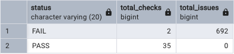
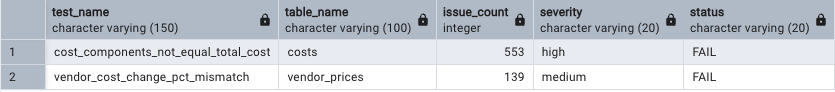

# Operations Profitability & Cost Optimization

## Project Overview

This project analyzes restaurant operations data to identify profitability drivers, cost inefficiencies, and opportunities to improve margins.

Using **SQL, Python, and Tableau**, the analysis follows a structured workflow to answer a key business question:

> **Where is profitability being lost, why is it happening, and what actions should leadership prioritize?**

Key focus areas include:

- Margin compression
- Cost inefficiencies
- Underperforming locations
- Cost growth trends
- Operational improvement opportunities
- Data quality and reconciliation issues

---

## Business Objective

The objective of this project is to identify operational profitability drivers and determine:

- Where profitability is being lost
- Why it is happening
- Which operational actions leadership should prioritize

---

## Business Questions

This project aims to answer:

- Which locations are most profitable?
- Are costs growing faster than revenue?
- Where is profitability being lost?
- Which product categories underperform?
- What operational actions should leadership prioritize?

---

## Tools Used

- PostgreSQL
- pgAdmin
- SQL
- Python
- pandas
- Jupyter Notebook
- Tableau Public
- GitHub

---

## Project Workflow

The analysis follows a structured workflow:

1. Data validation
2. Clean data preparation
3. SQL-based analysis
4. Python cleaning & feature engineering
5. Dashboard dataset creation
6. Tableau dashboard development
7. Business insights and recommendations

---

## Project Structure

```text
operations-profitability-cost-optimization/
│
├── sql/
│   ├── 00_data_validation_checks.sql
│   ├── 01_create_tables.sql
│   ├── 02_validation_outputs.sql
│   ├── 02_monthly_profitability.sql
│   ├── 03_location_performance.sql
│   └── 04_mom_cost_growth.sql
│
├── notebooks/
│   └── 01_data_validation.ipynb
│
├── data/
│   └── cleaned/
│       ├── validation_summary.csv
│       └── dashboard_final.csv
│
├── outputs/
│   ├── validation_results_final.csv
│   ├── monthly_profitability.csv
│   ├── location_performance.csv
│   └── mom_cost_growth.csv
│
├── images/
│   ├── validation_failures.png
│   ├── validation_summary.png
│   ├── monthly_profitability.png
│   ├── location_performance.png
│   └── mom_cost_growth.png
│
├── dashboard/
│   └── dashboard_screenshots/
│
└── README.md
```

---

# Data Quality Validation Framework

A SQL validation framework was created before analysis to ensure data reliability and analytical accuracy.

### Validation Checks Covered

- Missing values
- Duplicate records
- Negative values
- Orphan keys
- Date and month consistency
- Sales-to-cost join coverage
- Category consistency
- Cost reconciliation checks
- Vendor cost percentage reconciliation

---

## Validation Findings

Core structural checks passed successfully.

Two reconciliation issues were identified:

| Validation Test | Rows Affected | Severity |
|---|---:|---|
| `cost_components_not_equal_total_cost` | 553 | High |
| `vendor_cost_change_pct_mismatch` | 139 | Medium |

These issues represent **calculation inconsistencies**, not structural failures.

### Validation Screenshots

#### Validation Summary



#### Validation Failures



---

## Data Quality Decision

The dataset is considered reliable for analysis.

However, to improve analytical accuracy:

- `total_cost_clean` was recalculated using cost components
- `cost_change_pct_clean` was recalculated from unit costs

All downstream analysis uses **cleaned fields**.

---

# SQL Analysis

## 1. Monthly Profitability Analysis

### Method

- Aggregated sales data at month, location, and product level
- Recalculated `total_cost_clean`
- Joined sales and cost datasets

Calculated:

- Revenue
- Gross Profit
- Gross Margin %

### Key Findings

- Revenue remained stable between **$888K–$1.04M**
- Gross margin declined from **31.45% → 24.41%**
- Profit decreased despite stable revenue

### Business Interpretation

Profitability decline appears to be driven by **rising operational costs rather than declining sales**.

### Output

`outputs/monthly_profitability.csv`

### Screenshot


---

## 2. Location Performance Analysis

### Method

- Aggregated revenue and cost by location
- Calculated profit and margin
- Ranked locations by profit
- Flagged below-average margin locations

### Key Findings

- **Toronto Downtown** generates the highest profit but lower efficiency
- Several locations show stable performance
- **Hamilton and London** underperform in both profit and margin

### Business Interpretation

- High-performing locations still present cost optimization opportunities
- Underperforming locations require operational improvements

### Output

`outputs/location_performance.csv`

### Screenshot


---

## 3. Month-over-Month Cost Growth

### Method

- Aggregated monthly clean cost
- Used SQL `LAG()` window function to calculate prior month cost
- Computed monthly cost growth %
- Flagged spikes above 10%

### Key Findings

- **March cost spike: +14.85%**
- Other months show expected variation

### Business Interpretation

The March spike suggests possible operational issues such as:

- Vendor price increases
- Labor cost increases
- Overhead allocation changes
- Operational inefficiencies

### Output

`outputs/mom_cost_growth.csv`

### Screenshot


---

# Tableau Dashboard

The project includes a Tableau dashboard designed to support executive decision-making.

### Dashboard Structure

#### Page 1 — Executive Summary
- KPI Cards
- Revenue vs Cost Trend
- Gross Margin Trend
- Executive Insight Box

#### Page 2 — Profitability Drivers
- Gross Profit by Location
- Margin by Category
- Revenue vs Cost Analysis
- Cost Growth Trends
- Business Recommendations

#### Page 3 — Waste & Action Priorities
- Waste by Category
- Waste by Location
- Priority Actions

### Tableau Public

**Link:** *Coming Soon*

### Dashboard Screenshots

Dashboard screenshots will be added after final dashboard completion.

---

# Key Insights

- Profitability decline is driven primarily by **cost increases, not revenue loss**
- Gross margins compressed over time
- Some high-profit locations still show operational inefficiencies
- Cost spikes significantly impact profitability performance
- Data validation materially impacts business conclusions

---

# Business Recommendations

## High Priority
- Investigate drivers behind the March cost spike
- Audit cost structures in high-revenue locations

## Medium Priority
- Optimize labor and overhead allocation
- Improve vendor cost monitoring

## Low Priority
- Review pricing strategy if margin compression continues

---

# Senior-Level Capabilities Demonstrated

This project demonstrates:

- Data validation framework implementation
- SQL-based analytical modeling
- SQL window functions (`LAG`)
- Clean vs raw data handling
- Business-driven analysis
- KPI tracking
- Dashboard development
- Cost optimization analysis
- Structured and reproducible workflow
- Executive-level business storytelling

---

# Current Status

- [x] Database schema created
- [x] SQL validation framework created
- [x] Validation results saved
- [x] Validation screenshots created
- [x] Validation summary exported with Python
- [x] Validation findings documented
- [x] Monthly profitability analysis
- [x] Location performance analysis
- [x] Cost growth analysis
- [ ] Tableau dashboard
- [ ] Final business recommendations

---

# Future Improvements

- Forecasting
- Anomaly detection
- Predictive analytics
- Executive KPI benchmarking
- Automated reporting

---

# Lessons Learned

- Data validation is critical before analysis
- Business questions matter more than dashboards
- SQL becomes more valuable when tied to operational decisions
- Small data quality issues can significantly impact conclusions
- Executive dashboards should support decisions, not only visuals
- Business storytelling improves the impact of technical analysis

---

## Author

**Julio Carneiro**  
Aspiring Data Analyst | SQL | Python | Tableau | Business Analytics

GitHub:  
https://github.com/juliocezarcarneiro/operations-profitability-cost-optimization
